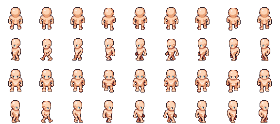
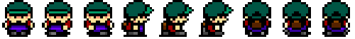
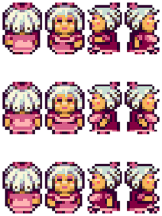
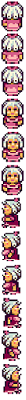
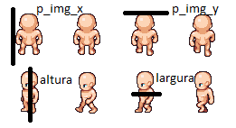

# **PLSprite**

   

Este projeto foi desenvolvido com propósito de facilitar a manipulação
de spritesheets para games 2D com uso da biblioteca Pygame.

## **Instalação**
<code>pip install PLSprite</code> (não disponível, dia 07/03/2022)

Para que consiga fazer uso do nosso projeto você precisará apenas instalar a biblioteca Pygame. Para isso, você pode usar o <code>pip</code>, ou algum instalador da sua preferência, com a seguinte linha de comando: <code>pip install pygame</code>.

## **Como melhorar**
Para que você possa adicionar melhorias ao projeto e queira desenvolver novas funcionalidades, você pode clonar o repositório com a seguinte linha de comando: <code>git clone https://github.com/Pyluu/PLSprite</code>, use este comando dentro da pasta onde deseja clonar o repositório.

## **Benefícios**
O nosso projeto tem como base ajudar a facilitar a maniuplação de spritesheets disponibilizando ferramentas de conversão, criação, inversão de sprites entre outras funcionalidades de manipulação para spritesheet.

## **Forma de usar**

Classe <code>Avatar()</code>, ela é responsável por criar um avatar com o spritesheet desejado.

Está classe só aceita spritesheets <code>AHLV</code>

***Chaves de spritesheets***

<code>AHLV</code>: Animação na Horizontal e Lados na Vertical</del>

<code>AHLH</code>: Animação na Horizontal e Lados na Horizontal

<code>AVLH</code>: Animação na Vertical e Lados na Horizontal

<code>AVLV</code>: Animação na Vertical e Lados na Vertical

**Exemplo de spritesheet** <code>AHLV</code>:




**Exemplo de spritesheet** <code>AHLH</code>:




**Exemplo de spritesheet** <code>AVLH</code>:




**Exemplo de spritesheet** <code>AVLV</code>




## **Como usar**

### ***Importação***
```Python
import PLSprite as PLS
import pygame as pg
```

*Importar a biblioteca Pygame e o nosso projeto, PLSprite, para que possamos começar a trabalhar. Agora vamos construir um avatar.*

### Antes de tudo

Parâmetros da Classe <code>Avatar()</code>

**tela**: Você deve passar a superficie onde seus sprites serão desenhados.

**spritesheet**: Você deve passar o spritesheet que deseja.

**p_img_x**: p_img_x(personagem imagem x). A posição x do sprite dentro do spritesheet.

**p_img_y**: p_img_y(personagem imagem y). A posição y do sprite dentro do spritesheet.

**x**: Recebe um valor, int, para definir a posição x do sprite.

**y**: Recebe um valor, int, para definir a posição y do sprite.

**largura**: Recebe um valor, int, que define a largura do sprite.

**altura**: Recebe um valor, int, que define a altura do sprite.

**chave_lados**: Uma lista/tupla com as chaves de direção/lados.

**Exemplo:**
```Python
chave_lados=[
            PLS.C_cima,
            PLS.C_baixo,
            PLS.C_esquerda, 
            PLS.C_direita
            ]
```

**num_animacao_h**: Recebe um valor, int, que é o número de sprites na horizontal.

**dimensao=None**: Recebe uma lista/tupla com a nova dimensão(largura e altura) do spritesheet.

### *Explicando parâmetros*



***Esta imagem contém as marcações de 4 parâmetros***

**p_img_x**: É a posição onde inicia o sprite na horizontal. Na imagem é possível ter uma ideia do que é p_img_x.

**p_img_y**: É onde inicia o sprite na vertical.

**altura**: Altura do sprite dentro do spritesheet.

**largura**: Largura do sprite dentro do spritesheet.

**OBS.:** *p_img_x não é o mesmo que o parâmetro x, enquanto x é a posição do sprite na janela p_img_x é a do sprite dentro do spritesheet. Igualmente para p_img_y e y*

A classe <code>Avatar()</code> só tem suporte para manipulação de spritesheets <a href="https://github.com/PyLuuu/PLSprite/edit/main/README.md#benef%C3%ADcios">AHLV</a>. Para facilitar o uso de spritesheets diversos temos a classe <code>ConverteSpriteSheet()</code>, ela suporta spritesheets **AHLH**(disponível), **AVLH**(indisponível), **AVLV**(indisponível), em breve todos estarão disponiveis.

***Agora vamos criar avatar***

## **Criando um objeto avatar**
```Python
pg.init() # Inicializando o Pygame
largura = altura = 500 # dimensões da janela
janela = pg.display.set_mode((largura, altura)) # criando janela
adao_spritesheet = pg.image.load('imagens/adao_andando.png') # pegando a imagem do meu spritesheet
run = True # estado do programa

# criando objeto
adao = PLS.Avatar(janela,
              adao_spritesheet,
              0,
              130,
              largura//2,
              altura//2,
              60,
              60,
              (0, 130, 65, 190),
              animacao_h=True,
              num_animacao_h=9)

while run:
    for event in pg.event.get(): # verificando lista de eventos do Pygame
        if event.type == pg.QUIT: # ao clicar para fechar a janela o event.type sera QUIT
            run = False # estado do programa recebe False
  
    janela.fill((0, 0, 0)) # após cada loop preenche a janela com a cor RGB: (0, 0, 0), ou seja, preto
    adao.atualizar() # fará com que o seu sprite seja desenhado na janela
  
    pg.display.flip() # após cada loop atualiza a janela

```
*Isso fará com que seu sprite seja exibido no centro da janela*

OBS.: Este exemplo de código está <a href="https://github.com/PyLuuu/PLSprite/blob/main/testes/construindo_avatar.py">aqui</a>, outros tutoriais de como usar cada tipo de spritesheets estão na pasta <code><a href="testes">testes</a></code>.

*Vá até o diretório de <code>testes</code>isso o ajudará a entender na prática como funciona nosso projeto.*

# Para contribuidores
Todos são muito bem-vindos(as)! Caso tenham ideias de como melhorar este projeto se manifeste 
e nos ajude a evoluir, peço que sejam criativos. Caso encontre bugs não se incomode em resolve-los, 
e ajude este pequeno projeto a se tornar uma ferramenta útil para desenvolvedores de jogos 2D.

# Links
- <a href="https://www.pygame.org/">Link para o site oficial do Pygame</a>

# Licença

MIT License

Copyright (c) 2022 Lus Henrique Alexandre dos S.

Permission is hereby granted, free of charge, to any person obtaining a copy
of this software and associated documentation files (the "Software"), to deal
in the Software without restriction, including without limitation the rights
to use, copy, modify, merge, publish, distribute, sublicense, and/or sell
copies of the Software, and to permit persons to whom the Software is
furnished to do so, subject to the following conditions:

The above copyright notice and this permission notice shall be included in all
copies or substantial portions of the Software.

THE SOFTWARE IS PROVIDED "AS IS", WITHOUT WARRANTY OF ANY KIND, EXPRESS OR
IMPLIED, INCLUDING BUT NOT LIMITED TO THE WARRANTIES OF MERCHANTABILITY,
FITNESS FOR A PARTICULAR PURPOSE AND NONINFRINGEMENT. IN NO EVENT SHALL THE
AUTHORS OR COPYRIGHT HOLDERS BE LIABLE FOR ANY CLAIM, DAMAGES OR OTHER
LIABILITY, WHETHER IN AN ACTION OF CONTRACT, TORT OR OTHERWISE, ARISING FROM,
OUT OF OR IN CONNECTION WITH THE SOFTWARE OR THE USE OR OTHER DEALINGS IN THE
SOFTWARE.

# Criadores
- **PyLuu**

### Contatos
- Pyluucatnet@gmail.com


**OBS.**: Este é meu primeiro README.md. Peço desculpa desde já caso não tenha ficado muito 
claro a explicação dos parâmetros para construir um avatar. Para melhor compreenção peço 
que leia as docstrings do nosso projeto. Obrigado por usar nosso projeto.
